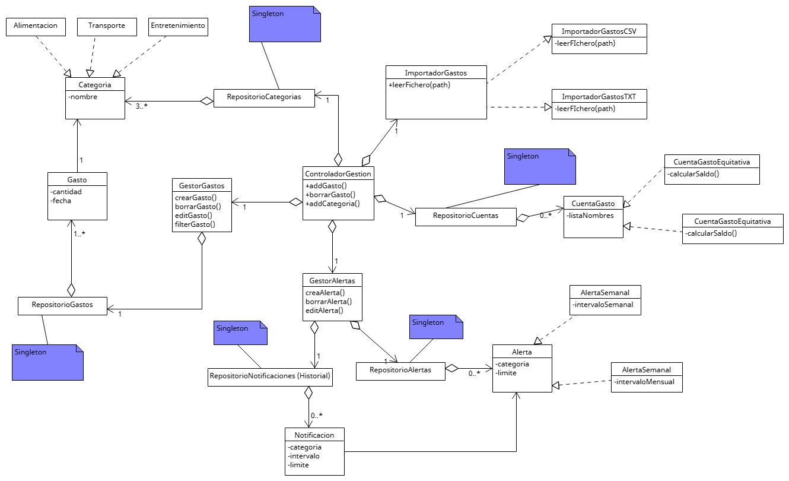

#  Diagrama de Clases del Dominio

A continuación se presenta el modelo estructural de la aplicación de **Gestión de Gastos**

## Descripción de las clases principales

El diagrama refleja cómo interactúan los distintos componentes del sistema a través de un controlador central (`ControladorGestion`). La arquitectura se divide en los siguientes bloques:

### 1. Controladores y Gestores
* **`ControladorGestion`:** Actúa como punto intermedio entre la vista y el modelo, permitiendo a la vista acceder a la implementación de la lógica del programa para mostrar la información necesaria. La vista siempre llamará a una función del controlador cuando necesite elementos del modelo, cumpliendo así el patron modelo-vista-controlador.
* **`GestorGastos` y `GestorAlertas`:** Engloban la lógica de negocio concreta para el manejo de las operaciones sobre gastos y alertas, respectivamente.

### 2. Entidades Base (Modelo)
* **`Gasto` y `Categoria`:** Un gasto se define por su cantidad y fecha, y pertenece a una única categoría. Pueden existir dinstinas categorías, como *Alimentación*, *Transporte*, *Entretenimiento*, y agrupan múltiples gastos.
* **`Notificacion`:** Representa el aviso generado cuando el usuario ha superado un límite económico establecido previamente.

### 3. Patrones de Diseño Representados / Arquitectura de la aplicacion
El diagrama muestra explícitamente cómo se han resuelto los requisitos avanzados del sistema mediante patrones de diseño:

* **Patrón Estrategia (Alertas):** La clase padre `Alerta` permite configurar límites económicos por categorías. De ella derivan clases concretas como `AlertaSemanal` y `AlertaMensual` (herencia), lo que permite al `GestorAlertas` evaluar dinámicamente si se ha superado un límite dependiendo del intervalo temporal.
* **Herencia en Cuentas Compartidas:** La clase `CuentaGasto` agrupa una lista de nombres de participantes. De esta clase base derivan `CuentaGastoEquitativa` y `CuentaGastoPorcentual`, implementando cada una su propio algoritmo para calcular el saldo que debe cada participante.
* **Patrón Adaptador y Factoría (Importación):** Se utiliza la clase abastracta `ImportadorGastos`. Implementaciones concretas como `ImportadorGastosCSV` e `ImportadorGastosTXT` adaptan los ficheros externos al modelo de objetos interno del programa.
* **Patrón Singleton (Repositorios):** Se garantiza una única instancia global para las clases encargadas de la persistencia de datos (`RepositorioGastos`, `RepositorioCategorias`, `RepositorioCuentas`, `RepositorioAlertas` y `RepositorioNotificaciones`). Esto asegura que toda la aplicación comparta el mismo estado de datos cargado desde los ficheros JSON.

