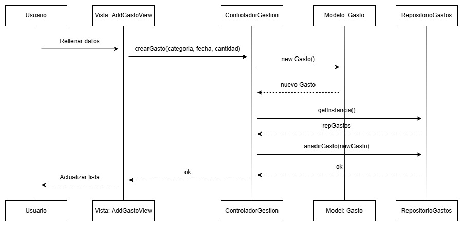

# Diagrama de Interacción

Para documentar la dinámica interna del sistema y la comunicación entre la capa de presentación y la capa de modelo/persistencia, se ha desarrollado el diagrama de secuencia correspondiente a la **Historia de Usuario 1: Añadir Gasto**.

Este diagrama demuestra la correcta aplicación del patrón arquitectónico Modelo-Vista-Controlador (MVC) y el patrón Controlador/Fachada (principios GRASP).

## Diagrama de Secuencia: Añadir un Gasto

## Explicación del Flujo

El diagrama ilustra el flujo de mensajes generados desde que el usuario interactúa con la interfaz gráfica hasta que los datos quedan persistidos en el sistema de almacenamiento.

1. **Interacción del Usuario:** El proceso comienza cuando el actor `Usuario` rellena los campos del formulario en la interfaz gráfica y presiona el botón para guardar, enviando el mensaje `Rellena formulario y pulsa "Guardar"` a la vista `AddGastoView`.
2. **Aislamiento de la Vista:** La vista no crea objetos ni accede a la base de datos directamente. Se limita a capturar los datos y enviarlos como parámetros al controlador principal mediante la llamada `addGasto(cantidad, fecha, categoria, nota)` a la clase `ControladorGestion`.
3. **Lógica de Negocio (Controlador):** El `ControladorGestion` toma el control de la operación. Su primera tarea es instanciar un nuevo objeto del modelo enviando el mensaje de creación `<<create>> new Gasto(...)` a la clase `Modelo: Gasto`. Una vez creado, recibe la referencia del objeto (`nuevoGasto`).
4. **Acceso al Singleton:** Una vez que el objeto `Gasto` está creado en memoria, el controlador solicita la instancia única del repositorio usando el método estático `getInstancia()` dirigido a `RepositorioGastos` y recibe la `instanciaRepo`.
5. **Persistencia de Datos:** El controlador invoca `addGasto(nuevoGasto)` sobre el repositorio. Como indica la nota en el diagrama, el repositorio se encarga internamente de persistir la información en formato JSON y devuelve un mensaje de confirmación (`ok`).
6. **Retorno a la Interfaz:** El controlador recibe la confirmación y envía un mensaje de `éxito` de vuelta a la vista. Finalmente, `AddGastoView` envía el mensaje de retorno al usuario: `Actualiza lista y cierra pop-up`, dando por finalizada la interacción.