#  Manual de Usuario - Gestión de Gastos

Bienvenido al manual de usuario de la aplicación de **Gestión de Gastos**. Esta guía le mostrará paso a paso cómo utilizar todas las funcionalidades del sistema para llevar un control exhaustivo de su economía personal.

---

## 1. Interfaz Principal y Navegación
Al iniciar la aplicación, se mostrará la ventana principal. Desde aquí podrá acceder a todas las herramientas del sistema.

* **Panel Central:** Muestra la información dependiendo de la pestaña seleccionada.

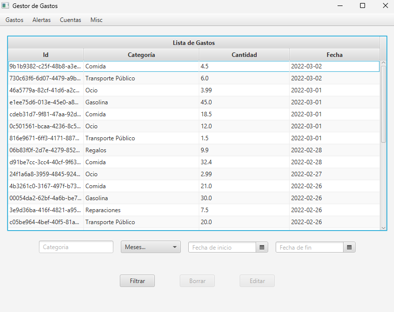

* **Barra de Menú - Gastos:** Permite navegar entre la vista de lista, calendario, gráficos y configuración de alertas.

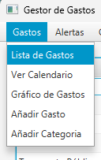

* **Barra de Menú - Alertas:** Permite acceder a las listas de las alertas.

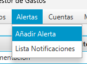

* **Barra de Menú - Cuentas:** Permite acceder a la lista de cuentas.

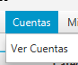

* **Barra de Menú - Misc:** Permite la importación de gastos, usar la aplicación en modo terminal y salir.

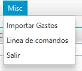

---

## 2. Gestión de Categorías y Gastos

### 2.1. Crear una nueva Categoría
Antes de añadir gastos, es recomendable tener categorías para organizarlos.
1. Haga clic en el botón **Crear Categoría**.
2. Introduzca el nombre deseado para la categoría.

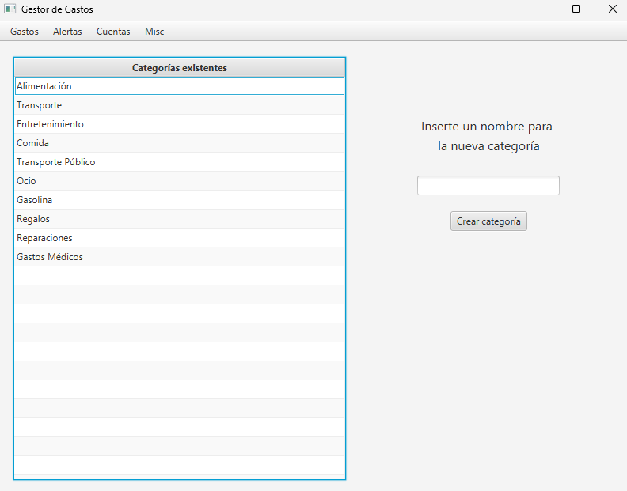

### 2.2. Añadir, Editar y Borrar un Gasto
1. Para añadir un gasto, pulse en el botón **Añadir Gasto** En la Barra menú superior. Se abrirá un formulario.
2. Introduzca la cantidad, seleccione la fecha en el calendario desplegable, asigne una categoría.
3. Pulse **Añadir Gasto**. El gasto aparecerá inmediatamente en la lista.
4. Para **editar** o **borrar**, seleccione un gasto de la lista en la ventana principal y utilice los botones correspondientes situados en la parte inferior de la vista.

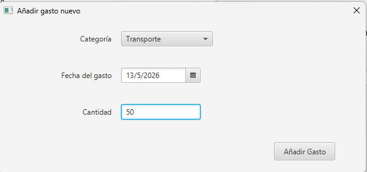

---

## 3. Visualización y Filtrado de Datos

El sistema ofrece diferentes vistas para analizar sus gastos:

* **Filtros de la vista principal:** Muestra todos los gastos detallados. Puede utilizar el panel de filtros lateral para buscar gastos por un **mes** concreto, en un **intervalo de fechas** o por una **categoría** específica.

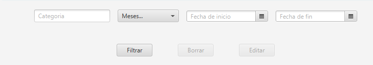

* **Vista Calendario:** Integrado mediante *CalendarFX*, permite visualizar los gastos distribuidos por días en meses. Esta vista también tendrá filtros para buscar por fechas y categorías.

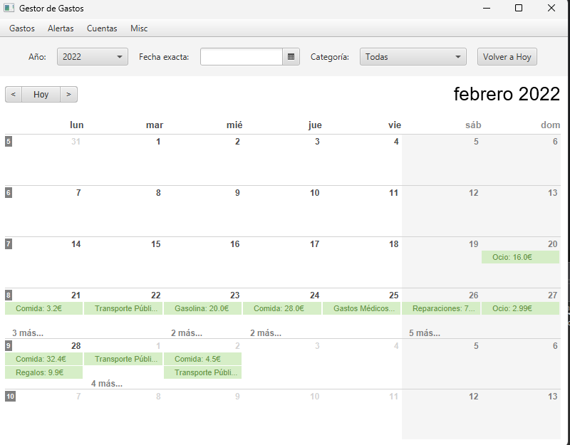

* **Vista Gráficos:** Seleccione esta opción para ver una representación visual (barras) de la distribución de sus gastos por categorías. En esta vista los gastos están filtrados por categorías y se podrán representar en función de la cantidad que tengan los gastos combinados de dicha categoría o bien por el número de gastos hechos para esa categoría.

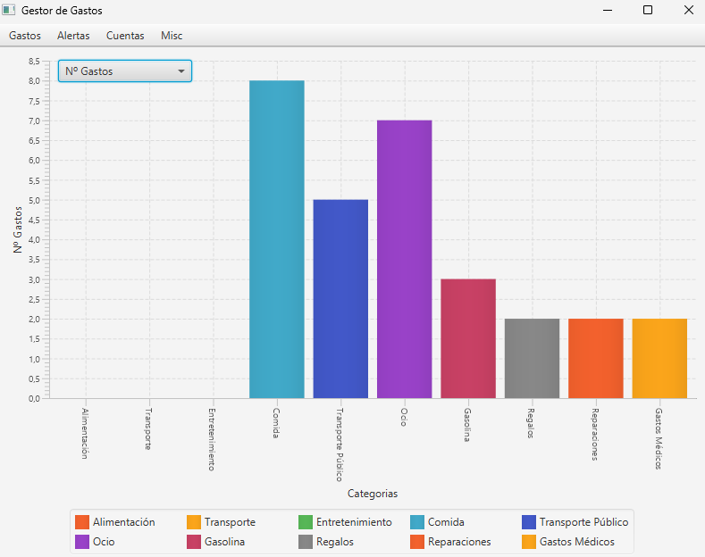

---

## 4. Sistema de Alertas y Notificaciones

Puede configurar el sistema para que le avise si gasta demasiado dinero.

1. Diríjase a la sección de **Alertas** en la Barra menú superior .
2. Pulse en **Crear Alerta**.
3. Defina si quiere que la alerta evalúe el gasto de forma **Semanal** o **Mensual**.
4. (Opcional) Asocie la alerta a una **Categoría** específica (ej. "Avisarme si gasto más de 50€ a la semana en Transporte").
5. Establezca el límite económico.

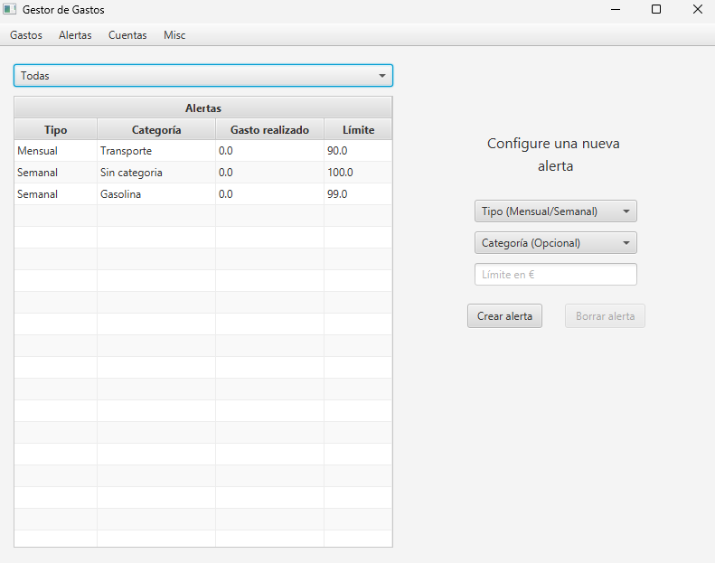

Esta vista también cuenta con un filtrado de la lista. En el desplegable superior de la vista se podrá selecciónar si se quieren filtran las alertas semanales, mensuales o en su defecto Todas.

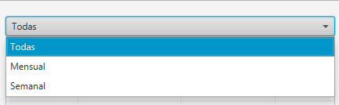

Cuando supere un límite configurado, aparecerá un aviso en la pantalla.

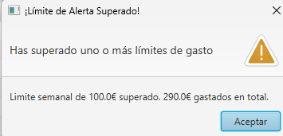

 Puede consultar el historial completo de avisos en la pestaña **Notificaciones** en la misma sección de alertas de la Barra menú superior .

 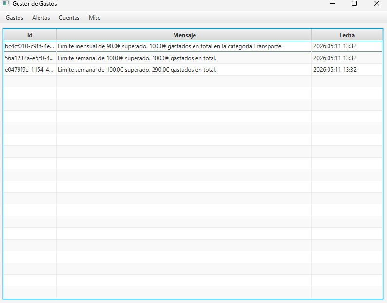

---

## 5. Cuentas Compartidas

Si comparte gastos con otras personas (compañeros de piso, viajes), utilice esta función.

1. Acceda a la sección de **Cuentas** en la Barra menú superior.

   1.1. En la izquierda podemos ver la lista de todas las cuentas disponibles, mientras que en la derecha podemos ver unma segunda tabla, que muestra los miembros, su saldo actual y la distribución asociada a cada uno de ellos. Para poder ver datos en esta tabla es necesario seleccionar una cuenta en la tabla de la izquierda.

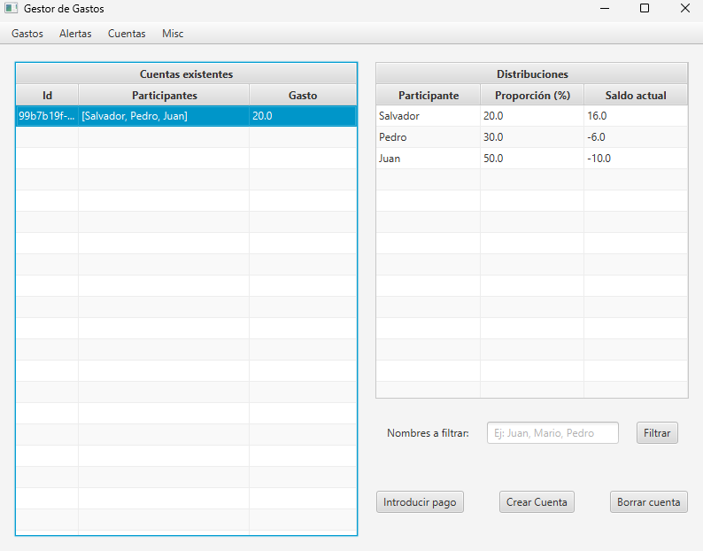

2. Pulse en **Crear Cuenta** e introduzca los nombres de los participantes y los porcentajes de gasto de cada uno de ellos en caso de no estar repartido equitativamente. El sistema seleccionará el tipo de cuenta automaticamente en funcion de los porcentajes. Recuerde que la primera persona introducida será el pagador de la cuenta.

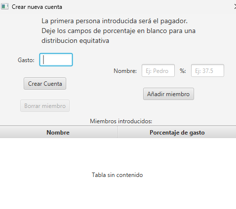

4. Pulse en **Introducir pago** para seleccionar el miembro de la cuenta al que introducir un pago, los saldos se recalcularan automaticamente. Cabe destacar que no es posbile introducir un pago en el pagador, ya que es a él a quien le deben pagar.

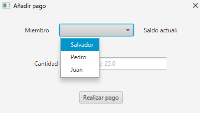

---

## 6. Importar Gastos Externos

Puede cargar sus movimientos bancarios directamente desde un archivo.

1. Pulse en la opción **Misc - Importar gastos** en la Barra menú superior.
2. Seleccione un archivo de texto en formato `.csv` o `.txt` desde su ordenador. **IMPORTANTE:** el fichero TXT necesita un formato especifico para que pueda ser leido. Ejemplo de formato: 

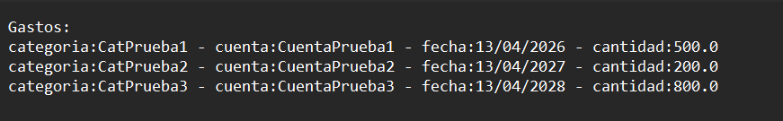

3. El sistema procesará el archivo y añadirá automáticamente todos los registros a su lista de gastos.

---

## 7. Uso desde la Línea de Comandos (Terminal)

La aplicación también permite gestionar gastos sin usar la interfaz gráfica principal.

1. Acceda a la consola integrada pulsando en **Misc - Línea de comandos**.
2. Escriba los comandos admitidos para añadir, listar o borrar gastos. El comando `help` mostrará todos los comandos disponibles, como se muestra a continuación.

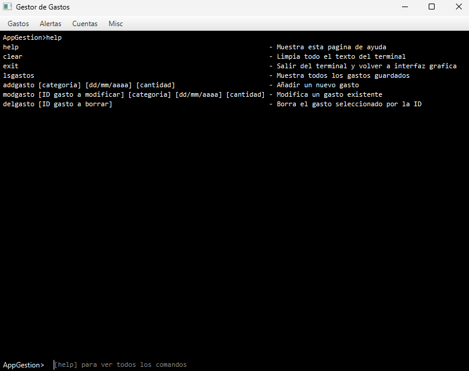